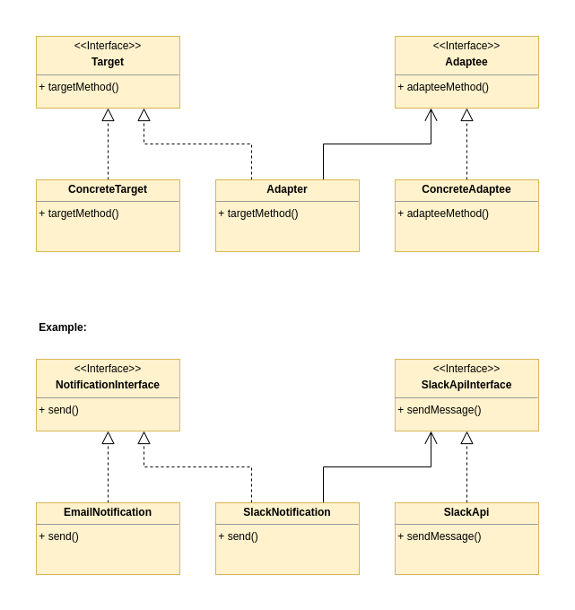

[Index](../../README.md)

# Adapter

This pattern allows objects with incompatible interfaces to collaborate.
The adapter is an object that converts the interface of one object so that another object can understand it.

## The problem

Imagine to have a ```NotificationInterface``` with a method ```send(string $title, string $message)```;<br />
The concrete class ```EmailNotification``` implements the interface and his method ```send(string $title, string $message)``` is responsible to send an email.<br />

Our client code calls a method ```handleNotification(NotificationInterface $notification)``` responsible to call the ```send``` method of the ```NotificationInterface``` concrete class instance passed as parameter.

At one point we decide to add the functionality to send a notification via Slack. In order to accomplish this we want to use the SlackAPI package (in this example represented by the SlackApi.php file).
The API gives us a method ```sendMessage(string $channel, string $message)```. We want to be able to call this method without changing the client code.
Before sending the notification we need to transform the message (in this example by simply chaining the title and the message itself) and tell the SlackAPI method to witch channel we want to send the notification to.

## The solution

The solution is to implement a new class SlackNotification with the same interface the client code expects.<br />
This new concrete class ```SlackNotification``` expects a ```SlackApiInterface``` object and a channel id in his constructor.<br />
In his implementation of the method ```send(string $title, string $message)``` after adapting the message it uses the ```SlackApi``` object to actually send the notification.<br />
This allows us to use the method ```handleNotification(NotificationInterface $notification)``` with the new ```SlackNotification``` object without changing anything in the method itself.

## UML diagram


## Links
[Refactoring Guru](https://refactoring.guru/design-patterns/adapter)<br />
